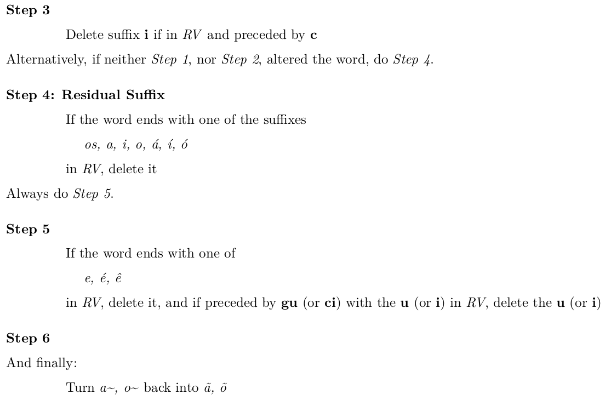

 
Snowball and RSLP Stemming Algorithms for Portuguese Language
========================================================
author: Victor Plesco
date: 16-09-2021
autosize: true
transition-speed: fast
width: 1920
height: 1080

Overview
========================================================

- Introduction
- Working of a Stemmer
- Conflation Methods
- Snowball
- RSLP  
- Errors & Metrics
- Results  

Information Retrieval: Query & Documents (1/36)
========================================================
 
- $\textbf{OBJECTIVE}$ - *Retrieving Documents Based on a Query*: In information retrieval (IR), the relationship between a query and a document is determined primarily by the number and frequency of terms which they have in common.

 

 

- $\textbf{PROBLEM}$ - *Different Morphological Variants*: Unfortunately, words have many morphological variants which will not be recognized by term-matching algorithms without additional text processing.

 "$\color{red}{\textit{ playing }}$" &nbsp; &nbsp; &nbsp; &nbsp; &nbsp; &nbsp; &nbsp; &nbsp; &nbsp; "$\color{red}{\textit{ played }}$" &nbsp; &nbsp; &nbsp; &nbsp; &nbsp; &nbsp; &nbsp; &nbsp; &nbsp; "$\color{red}{\textit{ plays }}$" 

Information Retrieval: Query & Documents (con't) (2/36)
========================================================
 
- $\textbf{SOLUTION}$ - *Treat Variants as Similar*: In most cases, these variants have similar semantic interpretations and can be treated as equivalent for information retrieval applications. What we're interested is, therefore, to reduce a term to its *base form*, which, in some sense, **represents a broader concept than the original word**, and, eventually, increase the number of retrieved documents in an IR system.

 

"stem" or "root"? (3/36)
========================================================

 **(Loving 1968)** [1] 

 "*A stemming algorithm is a computational procedure which reduces all words with the same root (or, if prefixes are left untouched, the same stem) to a common form, usually by stripping each word of its derivational and inflectional suffixes*". 

 

 $\text{unhappiness} \rightarrow \underbrace{\text{unhappy}}_{stem} \rightarrow \underbrace{\color{red}{\text{un}}\vphantom{\text{happy}}}_{\color{red}{prefix}}\text{ }\underbrace{\color{blue}{\text{happy}}}_{\color{blue}{root}}$ 

 

 **(Porter 2001)** [2] 

 However, here we will think of "*the stem as the residue of the stemming process, and the root as the inner word from which the stemmed word derives, so we think of root to some extent in an etymological way. We think of the etymological root of a word as something we can discover with certainty from a dictionary*". 

 

 The etymology of "*quarantine*" based on the Oxford's English dictionary. 

Working of a Stemmer (4/36)
========================================================

*The idea of stemming is to improve IR performance generally by bringing under one heading variant forms of a word which share a common meaning*. *Assuming words are written left to right,* **the stem of a word** *is on the left and zero or more suffixes may be added on the right. And also prefixes may be added on the left.* (Porter 2001) [2]. 

 

 $\underbrace{\vphantom{happi}\text{un }}_{\textit{prefix}} \text{ happ } \underbrace{\vphantom{happi}\text{ i }}_{\textit{y}} \underbrace{\vphantom{happi}\text{ ness}}_{\textit{suffix}}$ 

 

 Usually, prefixes alter meaning radically, so they are best left in place. But suffixes can, in certain circumstances, be removed. So for example *happy* and *happiness* have closely related meanings, and we may wish to stem both forms to *happy*, or *happi*. **We can separate suffixes out into three basic classes**: 

 

 "$\color{red}{\textit{d}}\text{ - suffixes }$" &nbsp; &nbsp; &nbsp; &nbsp; &nbsp; &nbsp; &nbsp; &nbsp; &nbsp; "$\color{red}{\textit{i}}\text{ - suffixes }$" &nbsp; &nbsp; &nbsp; &nbsp; &nbsp; &nbsp; &nbsp; &nbsp; &nbsp; "$\color{red}{\textit{a}}\text{ - suffixes }$" 

Attached or a-Suffixes (5/36)
========================================================
 

- $\textbf{a-Suffix}$ - *is a particle word attached to another word* (in the stemming literature they sometimes get referred to as "*enclitics*"). In ***Italian***, for example, personal pronouns attach to certain verb forms: 
$$
\begin{aligned}
\\
&\text{mandargli}    &&=\text{mandare}+\textbf{gli}             &&= \text{to send}+\text{to him} \\
&\text{mandarglielo} &&=\text{mandare}+\textbf{gli}+\textbf{lo} &&= \text{to send}+\text{it}+\text{to him} \\
\\
\end{aligned}
$$
In ***Portuguese*** they are separated by hyphen from the preceding word, which makes them easy to eliminate:

 *Decidiram incentivá* $\underbrace{\color{red}{\textit{-la}}}_{\textit{a}\text{-suffix}}$ *a juntar* $\underbrace{\color{red}{\textit{-se}}}_{\textit{a}\text{-suffix}}$ *a nós* $=$ *Avete deciso di incitar*  $\underbrace{\color{red}{\textit{la}}}_{\textit{a}\text{-suffix}}$ *ad unir* $\underbrace{\color{red}{\textit{si}}}_{\textit{a}\text{-suffix}}$  *a noi* 

Inflectional or i-Suffixes (6/36)
========================================================
 

- $\textbf{i-Suffix}$ - *forms part of the basic grammar of a language, and is applicable to all words of a certain grammatical type*, with perhaps a small number of exceptions. In ***English***, for example, the past of a verb is formed by adding **ed** (certain modifications may be required in the stem):
$$
\begin{aligned}
\\
&\text{fit}+\textbf{ed}  &&\rightarrow &&\text{fitted}+(\text{double }\textbf{t}) \\
&\text{love}+\textbf{ed} &&\rightarrow &&\text{loved}+(\text{drop the final }\textbf{e}\text{ of love}) \\
\\
\end{aligned}
$$
A *i*-suffix can serve more than one function. In ***English***, **s** can either be:  
$$
\begin{aligned}
\\
&\color{red}{\text{VERB ENDING}} &&\rightarrow &&\text{run}\color{red}{\textit{s}}, \ \ \text{sing}\color{red}{\textit{s}} &&\rightarrow &&\text{attached to third person singular forms.} \\
&\color{red}{\text{NOUN ENDING}} &&\rightarrow &&\text{dog}\color{red}{\textit{s}}, \ \ \text{cat}\color{red}{\textit{s}} &&\rightarrow &&\text{indicating the plural.} \\
&\color{red}{\text{NOUN ENDING}} &&\rightarrow &&\text{boy'}\color{red}{\textit{s}}, \ \ \text{girl}\color{red}{\textit{s}}\text{'} &&\rightarrow &&\text{indicating the possessive.} \\
\\
\end{aligned}
$$

Derivational or d-Suffixes (7/36)
========================================================
 

- $\textbf{d-Suffix}$ - *enables a new word, often with a different grammatical category, or with a different sense, to be built from another word*. Whether a *d*-suffix can be attached is discovered not from the rules of grammar, but by referring to a dictionary. So in ***English***, **ness** can be added to certain adjectives to form corresponding nouns:
$$
\begin{aligned}
\\
&\color{green}{\text{little }}\underbrace{\textit{ness}}_{\textit{d}\text{-suffix}} &&\color{green}{\text{kind }}\underbrace{\textit{ness}}_{\textit{d}\text{-suffix}} &&\color{green}{\text{foolish }}\underbrace{\textit{ness}}_{\textit{d}\text{-suffix}} \\
\\
\end{aligned}
$$
*d*-suffixes can be used to change meaning, often in exotic ways. So in ***Italian*** **astro** means a sham form of something else:
$$
\begin{aligned}
\\
&\text{medico}+\textbf{astro} &&=\text{medicastro} &&= \text{quack doctor} \\
&\text{poeta}+\textbf{astro}  &&=\text{poetastro}  &&= \text{poetaster} \\
\\
\end{aligned}
$$

Is there an order? (8/36)
========================================================
 

Generally *i*-suffixes follow *d*-suffixes:
$$
\begin{aligned}
\\
&\text{complicat } \underbrace{\color{red}{\textit{ion}}}_{\textit{d}\text{-suffix}} \ \  \underbrace{\color{red}{\textit{s}}}_{\textit{i}\text{-suffix}}  \\
\\
\end{aligned}
$$
However, *i*-suffixes can also precede *d*-suffixes:
$$
\begin{aligned}
\\
&\text{devot } \underbrace{\color{red}{\textit{ed}}}_{\textit{i}\text{-suffix}} \ \  \underbrace{\color{red}{\textit{ness}}}_{\textit{d}\text{-suffix}}  \\
\\
\end{aligned}
$$
Since the normal order of suffixes is *d*, *i* and *a*, we can expect them to be removed from the right in the order
 
 

 $\textit{a}\text{ -suffixes}$ &nbsp; &nbsp; &nbsp; &nbsp; $\rightarrow$ &nbsp; &nbsp; &nbsp; &nbsp; $\textit{i}\text{ -suffixes}$ &nbsp; &nbsp; &nbsp; &nbsp; $\rightarrow$ &nbsp; &nbsp; &nbsp; &nbsp; $\textit{d}\text{ -suffixes}$ 

Conflation Methods (9/36)
========================================================
 

 *If the stemming process reduces two words to the same stem, they are said to be* **conflated** (Porter 2001) [2].  

Affix Removal Method (10/36)
========================================================
 

- $\textbf{Affix Removal Method}$ - removes **suffix** or **prefix** from the words so as to convert them into a common stem form. Affix
removal method is based on two principles:  

  * 
 <b>Iterations</b>: an <em>iterative stemming algorithm</em> is simply a recursive procedure, as its name implies, which removes strings in each order-class one at a time, starting at the end of a word and working toward its beginning. No more than one match is allowed within a single order-class, by definition. Iteration is usually based on the fact that suffixes are attached to stems in a "<em>certain order</em>", that is, there exist order-classes of suffixes. 

  
      (**Example with RSLP Stemmer**)
$$
\begin{aligned}
\\
&\textbf{Input :} \text{ mentoras} \\
&&\underbrace{\text{mentora } \underbrace{\color{red}{\textit{s}}}_{\text{Plural Reduction}}}_{\textbf{Step 1}}
&&\rightarrow
&&\underbrace{\text{ mentor } \underbrace{\color{red}{\textit{a}}}_{\text{Feminine Reduction}}}_{\textbf{Step 2}} \\
&\textbf{Output :} \text{ mentor} \\
\\
\end{aligned}
$$

  * 
 <b>Longest Match</b>: the <em>longest match principle</em> states that within any given class of endings, if more than one ending provides a match, the one which is longest should be removed. 

Successor Variety Method (11/36)
========================================================
 

- $\textbf{Successor Variety Method}$ - successor variety stemmers use the frequencies of letter sequences in a body of text as the basis of
stemming. In less formal terms, the successor variety of a string is the number of different characters that follow it in words in some body of text.
$$
\begin{aligned}
\\
\end{aligned}
$$

$$
\begin{aligned}
\\
\end{aligned}
$$

 To determine the successor varieties for "<em>battle</em>" (see below) the following process would be used. The first letter of battle is <b>b</b>. <b>b</b> is followed in the text body by three characters: <b>a</b>, <b>e</b>, and <b>o</b>. Thus, the successor variety of <b>b</b> is three. The next successor variety for "<em>battle</em>" would be one, since only <b>c</b> follows <b>ba</b> in the text. <em>When this process is carried out using a large body of text, the successor variety of substrings of a term will decrease as more characters are added until a segment boundary is reached. At this point, the successor variety will sharply increase. This information is used to identify stems</em>. 

Table Lookup Method (12/36)
========================================================
 

- 
 <b>Table Lookup Method</b> - <em>one way to do stemming is to store a table of all index terms and their stems</em>. Terms from queries and indexes could then be stemmed via table lookup. Using B-tree or Hash table, such lookups would be very fast. However, there are problems with this approach:

  * 
For making these lookup tables we need to extensively work on a language. There will be some probability that these tables may miss out some exceptional cases, since they are domain dependent.

  * 
Another problem is the storage overhead for such a table, though trading size for time is sometimes warranted. Storing precomputed data, as opposed to computing the data values on the fly, is useful when the computations are frequent and/or expensive.

$$
\begin{aligned}
\\
&\textit{Term} &&\textit{Stem} \\ 
\\
&\text{engineering} &&\text{engineer} \\
&\text{engineered} &&\text{engineer} \\
&\text{engineer} &&\text{engineer} \\ 
\\
\end{aligned}
$$

n-gram Method (13/36)
========================================================
 

- 
 <b>n-gram Method</b> - <em>in this approach, pairs of words are associated on the basis of unique digrams they both possess</em>. For example, the terms </em>information</em> and <em>informative</em> can be broken into digrams as follows: 

$$
\begin{aligned}
&\textit{information}  &&\rightarrow &&\text{in nf fo or rm ma at ti io on} \\
&\text{unique digrams} &&=           &&\text{in nf fo or rm ma at ti io on} \\ 
&\textit{informative}  &&\rightarrow &&\text{in nf fo or rm ma at ti iv ve} \\
&\text{unique digrams} &&=           &&\text{in nf fo or rm ma at ti iv ve} \\  
\\
\end{aligned}
$$

 Thus, "<em>information</em>" has ten digrams, of which all are unique, and "<em>informative</em>" also has ten digrams, of which all are unique. The two words share eight unique digrams: <b>in</b>, <b>nf</b>, <b>fo</b>, <b>or</b>, <b>rm</b>, <b>ma</b>, <b>at</b>, and <b>ti</b>. Once the unique digrams for the word pair have been identified and counted, a similarity measure based on them is computed. The similarity measure used is Dice's coefficient [3]: 

$$
\begin{aligned}
S=\frac{2\text{C}}{\text{A}+\text{B}}=\frac{2 \times 8}{10+10} = 0.80 \\
\\
\end{aligned}
$$

 where <b>A</b> <em>is the number of unique digrams in the first word</em>, <b>B</b> <em>the number of unique digrams in the second</em>, and <b>C</b> <em>the number of unique digrams shared by</em> <b>A</b> <em>and</em> <b>B</b>. Such similarity measures are then determined for all pairs of terms in the database. Once such similarity is computed for all the word pairs they are clustered as groups. 

Snowball for Portuguese (14/36)
========================================================
 

- 
 <b>Snowball</b> is a small string processing language for creating stemming algorithms for use in Information Retrieval, plus a collection of stemming algorithms implemented using it. It was originally designed and built by Martin Porter. Martin retired from development in 2014 and Snowball is now maintained as a community project. The Snowball compiler translates a Snowball program into source code in another language - currently `Ada`, `ISO C`, `C#`, `Go`, `Java`, `Javascript`, `Object Pascal`, `Python` and `Rust` are supported [4]. 

 

Stemming Portuguese (15/36)
========================================================
 

Letters in Portuguese include the following accented forms:

 *á*, &nbsp; *é*, &nbsp; *í*, &nbsp; *ó*, &nbsp; *ú*, &nbsp; *â*, &nbsp; *ê*, &nbsp; *ô*, &nbsp; *ç*, &nbsp; *ã*, &nbsp; *õ*, &nbsp; *ü*, &nbsp; *ñ* 

The following letters are vowels:

 *a*, &nbsp; *e*, &nbsp; *i*, &nbsp; *o*, &nbsp; *u*, &nbsp; *á*, &nbsp; *é*, &nbsp; *í*, &nbsp; *ó*, &nbsp; *ú*, &nbsp; *â*, &nbsp; *ê*, &nbsp; *ô* 

And the two nasalized vowel forms, 

 *ã* and *õ*, 
 

 should be treated as a vowel followed by a consonant. <em>ã</em> and <em>õ</em> are therefore replaced by <b>a~</b> and <b>o~</b> in the word, where ~ is a separate character to be treated as a consonant. 

Defining R1, R2 and RV (16/36)
========================================================
 

- **R1** - *region after the first non-vowel following a vowel, or is the null region at the end of the word if there is no such non-vowel*.
- **R2** - *region after the first non-vowel following a vowel in R1, or is the null region at the end of the word if there is no such non-vowel*.

 Below, R1 and R2 are shown for term <em>beautiful</em>. Letter <b>t</b> is the first non-vowel following a vowel in beautiful, so R1 is <b>iful</b>. In <b>iful</b>, the letter f is the first non-vowel following a vowel, so R2 is <b>ul</b>. 

$$
\begin{aligned}
\text{b} \ \ \ \ \ \ \text{e} \ \ \ \ \ \ \text{a} \ \ \ \ \ \ \text{u} \ \ \ \ \ \ \text{t} \ \ \ \ \ \ &\text{i} \ \ \ \ \ \ \text{f} \ \ \ \ \ \ \text{u} \ \ \ \ \ \ \text{l} \\ 
&\color{red}{\text{i}} \ \ \ \ \ \ \color{red}{\text{f}} \ \ \ \ \ \ \color{red}{\text{u}} \ \ \ \ \ \ \color{red}{\text{l}} \ \ \ \ \ \color{black}{\text{(R1)}} \\ 
&\hphantom{\color{red}{\text{i}} \ \ \ \ \ \ \color{red}{\text{f}} \ \ \ \ \ \ } \color{red}{\text{u}} \ \ \ \ \ \ \color{red}{\text{l}} \ \ \ \ \ \color{black}{\text{(R2)}} \\ 
\end{aligned}
$$

- **RV** - **if the second letter** *is a consonant, RV is the region after the next following vowel, or* **if the first two letters** *are vowels, RV is the region after the next consonant, and otherwise* (**consonant-vowel case**) *RV is the region after the third letter. But RV is the end of the word if these positions cannot be found. For example,*

$$
\begin{aligned}
\text{m} \ \ \text{a} \ \ \text{c} \ \ &\text{h} \ \ \text{o} \ \ \ \ &&\text{o} \ \ \text{l} \ \ \text{i} \ \ \text{v} \ \ \text{a} \ \ \ \ &&\text{t} \ \ \text{r} \ \ \text{a} \ \ \text{b} \ \ \text{a} \ \ \text{j} \ \ \text{o} \ \ \ \ &&\text{á} \ \ \text{u} \ \ \text{r} \ \ \text{e} \ \ \text{o}  \\
& \color{red}{\text{h}} \ \ \color{red}{\text{o}}
&& \ \ \ \ \ \ \ \ \ \ \color{red}{\text{v}} \ \ \color{red}{\text{a}}
&& \ \ \ \ \ \ \ \color{red}{\text{a}} \ \ \color{red}{\text{b}} \ \ \color{red}{\text{a}} \ \ \color{red}{\text{j}} \ \ \color{red}{\text{o}}
&& \ \ \ \ \ \ \ \ \ \ \ \color{red}{\text{e}} \ \ \color{red}{\text{o}} \ \ \ \ \ \color{black}{\text{(RV)}} \\
\end{aligned}
$$

Step 1: Standard Suffix Removal (17/36)
========================================================
 

Step 2: Verb Suffixes (18/36)
========================================================
 

Steps 3-6 (19/36)
========================================================
 

Removedor de Sufixos da Língua Portuguesa (RSLP) (20/36)
========================================================
 

 <em>The stemming of English seems to be a resolved problem, the Porter stemmer is a simple suffix-stripping algorithm that is based solely on rules, without exception lists or dictionary lookups, however it has proved to be as effective as more elaborated systems. Our challenge is to design a suffix-stripping algorithm that is both simple and effective with the target of improving recall, without decreasing precision</em> (V. Orengo & C. Huyc 2001) [5]. 

The Algorithm (21/36)
========================================================
 

- 
 <b> RSLP</b>: the algorithm is composed by eight steps that need to be executed in a certain order. Each step has a set of rules. The rules in the steps are examined in sequence and only one rule in a step can apply. The longest possible suffix is always removed first because of the order of the rules within a step, e.g., the plural suffix es should be tested before the suffix s. At the moment, the Portuguese stemmer contains 199 rules. Each rule states:

  * **Suffix to be removed**: "*inho*"
  * **Minimum length of the stem**: "*3*" 
  * **Replacement suffix (if necessary)**: ""
  * **List of exceptions**: {"*caminho*", "*carinho*", "*cominho*", "*golfinho*", "*padrinho*", "*sobrinho*", "*vizinho*"}

Difficulties in Stemming Portuguese (22/36)
========================================================
 

- 
 <b> Dealing with Exceptions</b>: for nearly every rule there are exceptions, e.g., <b>ão</b> is a commonly used suffix to denote augmentative, however not all words ending in <b>ão</b> are in augmentative forms. 

- 
 <b> Homographs</b> (i.e., <em>words which are spelled identically but which have different meanings</em>): there are several such cases, e.g., <em>casais</em> which can mean "couples" or 2-<em>nd</em> person plural of the verb "to marry". `RSLP` does not have information about word categories, so the different senses of those words are not distinguished. 

- 
 <b> Irregular Verbs</b>: the current version of the stemmer is not treating irregular verbs, but surprisingly they do not seem to seriously affect our results. The tests have shown that less than 1% of the mistakes occur because of this reason (V. Orengo & C. Huyc 2001) [5]. 

- 
 <b> Changes to the Morphological Root</b>: there are cases in which the inflection process changes the root of the word. The cases in which the change obeys orthographic rules (e.g., <b>ns</b> → <b>m</b>) are being successfully treated. However, words like <em>emitir</em> (i.e., to emit) and <em>emissão</em> (i.e., emission), which are semantically related, are not being conflated.

$$
\begin{aligned}
&\textit{emitir } → \textit{emit} &&\text{and} &&\textit{emissão } → \textit{emis} \\
\\
\end{aligned}
$$
- 
 <b> Stemming Proper Names</b>: proper names should not be stemmed, the problem is recognizing them. As the Porter stemmer, the present implementation of our algorithm is stemming proper names.

Step 1: Plural Reduction (23/36)
========================================================
 

* Removing the final "*s*" of the words that are not listed as (rare) exceptions.
* Not all words ending in "*s*" denote plural:
  * **lápis**
* Sometimes a few extra modifications are needed (e.g., **ns** → **m**):
  * *bons* → *bom*
  
Step 2: Feminine Reduction (24/36)
========================================================
 

* Transforming feminine forms to their corresponding masculine.
* Only words ending in "*a*" are tested.
* Not all of them are converted, just the ones ending in the most common suffixes:
  * "*chinesa*" → "*chinês*"

Step 3: Adverb Reduction (25/36)
========================================================
 

* There is just one suffix that denotes adverbs:
  * **mente**
* Not all words with "*mente*" ending are adverbs.
* Exception list is needed. 

Step 4: Augmentative/Diminutive Reduction (26/36)
========================================================
 

* Treat augmentative, diminutive and superlative forms:
  * **casinha** (i.e., small house): "*inha*" is a diminutive suffix
* There are 38 of these suffixes.
* Algorithm uses only the most common ones.

Step 5: Noun Suffix Reduction (27/36)
========================================================
 

* Tests words against 61 noun (and adjective) endings.
* If a suffix is removed here, *Step 6* and *Step 7* are not executed.

Step 6: Verb Suffix Reduction (28/36)
========================================================
 

* Portuguese regular verbs have over 50 forms (English just for, i.e., *talk*, *talks*, *talked*, *talking*).
* Each one has its specific suffix.
* Verbs can vary according to tense, person, number, and mode.
* Structure of the verbal forms:
  * *root* + *thematic vowel* + *tense* + *person*
    * **Thematic vowel**: there are 3 classes of verbs in Portuguese according to the ending of their infinitive form: **ar**, **er**, and **ir**. The thematic vowel is the letter ("*a*", "*e*" and "*i*") that groups verbs into categories.
    * e.g., *and* + *a* + *ra* + *m* (i.e., *they walked*).
* Verbal forms are reduced to their root. 

Step 7: Vowel Removal (29/36)
========================================================
 

* Removing the last vowel of words not stemmed by *Step 5* and *Step 6* (i.e., **a**, **e** or **o**):
  * e.g., **menino** (i.e., *boy*) would not suffer any modifications by the previous steps, therefore this step will remove its final **o**, so that it can be conflated with other variant forms such as *menina*, *meninice*, *meninão*, *menininho*, which will also be converted to the stem *menin*.

Step 8: Accents Removal (30/36)
========================================================
 

* Some forms of the word are accented:
  * **psicólogo** (i.e., *psychologist*) and **psicologia** (i.e., *psychology*).
* Important that this step is done at this point.
* Presence of accents is significant for some rules:
  * óis → ol
  * sóis (i.e., suns) → sol (i.e., sun)
* If the rule was:
  * ois → ol
  * dois (i.e., two) → dol (mistake)
  
Stemming Errors (31/36)
========================================================
 

 "<em>There are two particular problems in using stemming for word standardization. In the first place, pairs of etymologically related words sometimes differ sharply in meaning - for example, consider "author" and "authoritarian". In the second place, the transformations involved in adding and removing suffixes involve numerous irregularities and special cases</em>" (Paice 1990) [6].

- 
 <b>Understemming Errors</b>: words which refer to the same concept are not reduced to the same stem. 

- 
 <b>Overstemming Errors</b>: words are converted to the same stem even though they refer to distinct concepts. 

In designing a stemming algorithm there is a trade-off between these two kinds of error. A <em>light stemmer</em> plays safe in order to avoid overstemming errors, but consequently leaves many understemming errors. A <em>heavy stemmer</em> boldly removes all sorts of endings, some of which are decidedly unsafe, and therefore commits many overstemming errors.

Evaluation Metrics (32/36)
========================================================
 

In his paper, Paice [12] outlines an approach to stemmer evaluation which is based on detecting and counting the actual under- and overstemming errors committed during stemming of word samples derived from actual texts. This permits the computation of a “stemming weight” index for each stemmer, as well as indices representing the under- and overstemming error rates and the general accuracy. The method involves manually dividing a sample of words into conceptual groups, and referring the actual stemming performance to these groups. To assess the quality of stemming algorithms, Paice [12] proposes four intrinsic metrics:

- 
 <b>Overstemming Index</b> (OI): calculates the number of times a stemmer mistakenly removes part of the stem as if it were part of the suffix. This type of error will typically cause unrelated words to be combined, e.g., <em>news</em> and <em>new</em> are both stemmed to <em>new</em>. are not reduced to the same stem. 

- 
 <b>Understemming Index</b> (UI): calculates the number of times a stemmer fails to remove a suffix. This type of error will typically prevent related words from being conflated, e.g., if <em>division</em> is stemmed to <em>divis</em> and <em>divide</em> is stemmed to <em>divid</em>. 

- 
 <b>Stemming Weights</b> (SW): is the ratio OI/UI. A "heavy" stemmer applies many of affix stripping rules and thus has a high OI and a low UI, while a "light" stemmer applies few affix stripping rules and thus has a low OI and a high UI. Having a high or low SW does not indicate whether a stemmer is better, since a better stemmer would simultaneously have a lower OI and UI. 

Evaluation Metrics (con't) (33/36)
========================================================
 

- 
 <b>Error Rate Relative to Truncation</b> (ERRT): in order to obtain some kind of baseline against which the general accuracy of a stemmer may be judged, we refer to the process of length truncation - that is, reducing every word to just its first q letters (words shorter than q being left unchanged). Length truncation is the crudest method of stemming, and we would obviously expect any rule-based stemmer to do better. 

 

 

Evaluation Metrics (con't) (34/36)
========================================================
 

 

 The idea here is that if we determine values of `UI` and `OI` for a series of truncation lengths, the `(UI,OI)` coordinates define a truncation line against which any stemmer can be assessed. Any reasonable stemmer will give a `(UI,OI)` point between the truncation line and the origin; in general, the further away the point is from the truncation line, the better the stemmer can be said to be. Specifically, a performance measure which we may call the error rate relative to truncation, or ERRT, can be obtained by extending a line from the origin O through the `(UI,OI)` point P until it intersects the truncation line at T

$$
\begin{aligned}
ERRT = \text{length}(\textbf{OP})/\text{length}(\textbf{OT}) \ .
\end{aligned}
$$

Experimental Arrangements (35/36)
========================================================
 

 The <b>Paice's method</b> [6] requires groups of semantically and morphologically related words. In order to generate such groups, a battle tested stemmer, namely Hunspell [7], was applied to three different samples of unique words [8]:

- 
  18.076 words extracted from websites news
- 
 15.037 randomly crawled web words
- 
 20.101 words extracted from Wikipedia pages
- 
 32.164 words merged from previous

***
 

Prior to the stemming phase, an array of 6 pre-processing techniques was applied to each of the corpuses, namely:

- 
 <em>Lowercasing</em>
- 
 <em>Stopwords Removal</em>
- 
 <em>Numbers Removal</em>
- 
 <em>Whitespace Removal</em>
- 
 <em>Punctuation Removal</em>
- 
 <em>Special Characters Removal</em>

Results (36/36)
========================================================
 

 If now we compare the pattern of values within the different samples of <b>Tables 1-4</b>, we can find no marked differences, and this suggests that the properties and validity of the indices are not strongly affected by the level of grouping - provided that a consistent strategy is used. 

 Although the magnitudes of the differences varied a good deal, and in a couple of cases were only marginal, the above inequalities actually held for all of the word samples tested. If we take ERRT as a general indicator of performance accuracy, we would have to conclude that Porter is a better stemmer than RSLP. However, the differences in stemming weight between Porter and RSLP are so great that it is probably meaningless to compare their accuracy: RSLP is a heavy stemmer and Porter a light stemmer, and presumably each is suited to a different task. 

References
========================================================
 

1. J. Lovins (1968). Development of a stemming algorithm. *Mechanical Translation and Computational Linguistics*, 11:22–31.  
2. M. F. Porter (2001). Snowball: A language for stemming algorithms. 
3. W. B. Frakes (1992). "Stemming Algorithm" in *Information Retrieval: Data Structures and Algorithms* (pp. 132-139).
4. "Portuguese stemming algorithm". `https://snowballstem.org/algorithms/portuguese/stemmer`. Accessed 15 Set. 2021.
5. V. Orengo & C. Huyck (2001). A Stemming Algorithm for The Portuguese Language. *In Proceedings of Eighth Symposium on String Processing and Information Retrieval* (SPIRE 2001), pages 186-193, Laguna de San Raphael, Chile.
6. C. D. Paice (1990). An evaluation method for stemming algorithms. In *Proceedings of the 17th ACM SIGIR conference on research and development in information retrieval* (pp. 42-50).
7. "Hunspell". `https://en.wikipedia.org/wiki/Hunspell`. Accessed 4 Oct. 2021. 
8. `https://wortschatz.uni-leipzig.de/en/download/Portuguese`. Accessed 4 Oct. 2021.  
