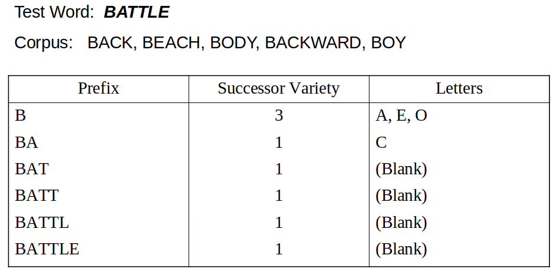
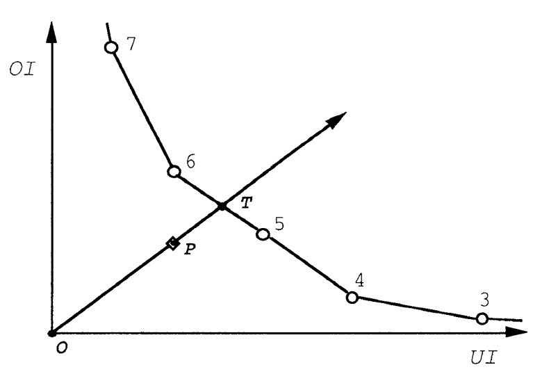

```{r setup, include=FALSE}
knitr::opts_chunk$set(echo = TRUE)

require(knitr); require(dplyr); require(kableExtra); require(forestmangr);
```  

\newpage  
# 1. Introduction  

\ \ \ \ In information retrieval (IR), the relationship between a query and a document is determined primarily by the number and frequency of terms which they have in common. Unfortunately, words have many morphological variants which will not be recognized by term-matching algorithms without additional text processing. In most cases, these variants have similar semantic interpretations and can be treated as equivalent for information retrieval (as opposed to linguistic) applications (Hull & Grefenstette 1996) [1]. For example, if a user wants to search for a document on "*how to cook*" and submits a query on "*cooking*", he/she may not get all the relevant results. However, if "*cooking*" is reduced to its root "*cook*", since the root of a term represents a broader concept than the original term, the number of retrieved documents in an IR system may eventually increase. The idea of stemming is, therefore, to improve IR performance generally by bringing under one heading variant forms of a word which share a common meaning.  

# 2. Working of a Stemmer   

\ \ \ \ Stemming is not a concept applicable to all languages. It is not, for example, applicable in Chinese. But to languages of the Indo-European group, a common pattern of word structure does emerge. Assuming words are written left to right, the stem, or root of a word is on the left, and zero or more suffixes may be added on the right. If the root is modified by this process it will normally be at its right hand end. And also prefixes may be added on the left. So *unhappiness* has a prefix **un**, a suffix **ness**, and the **y** of *happy* has become **i** with the addition of the suffix. Usually, prefixes alter meaning radically, so they are best left in place (German and Dutch **ge** is an exception here). But suffixes can, in certain circumstances, be removed. So for example *happy* and *happiness* have closely related meanings, and we may wish to stem both forms to *happy*, or *happi*. Infixes can occur, although rarely: **ge** in German and Dutch, and **zu** in German (Porter 2001) [2].  
\ \ \ \ Lovins (1968), defines a stemming algorithm as "*a computational procedure which reduces all words with the same root (or, if prefixes are left untouched, the same stem) to a common form, usually by stripping each word of its derivational and inflectional suffixes*" [3]. However, here we will think of the stem as the residue of the stemming process, and the root as the inner word from which the stemmed word derives, so we think of root to some extent in an etymological way. We think of the etymological root of a word as something we can discover with certainty from a dictionary (Porter 2001) [2].  

## 2.1 Attached, Inflectional and Derivational Suffixes  

\ \ \ \ We can separate suffixes out into three basic classes, which will be called *d*-, *i*- and *a*-suffixes. An *a*-suffix, or *attached* suffix, is a particle word attached to another word (in the stemming literature they sometimes get referred to as "*enclitics*"). In Italian, for example, personal pronouns attach to certain verb forms:

&nbsp;
$$
\begin{aligned}
&\text{mandargli}    &&=\text{mandare}+\textbf{gli}             &&= \text{to send}+\text{to him} \\
&\text{mandarglielo} &&=\text{mandare}+\textbf{gli}+\textbf{lo} &&= \text{to send}+\text{it}+\text{to him}
\end{aligned}
$$
&nbsp;

\ \ \ \ *a*-suffixes appear in Italian and Spanish, and also in Portuguese, although in Portuguese they are separated by hyphen from the preceding word, which makes them easy to eliminate. An *i*-suffix, or *inflectional* suffix, forms part of the basic grammar of a language, and is applicable to all words of a certain grammatical type, with perhaps a small number of exceptions. In English, for example, the past of a verb is formed by adding **ed**. Certain modifications may be required in the stem:

&nbsp;
$$
\begin{aligned}
&\text{fit}+\textbf{ed}  &&\rightarrow &&\text{fitted}+(\text{double }\textbf{t}) \\
&\text{love}+\textbf{ed} &&\rightarrow &&\text{loved}+(\text{drop the final }\textbf{e}\text{ of love})
\end{aligned}
$$
&nbsp;

\ \ \ \ A *d*-suffix, or *derivational* suffix, enables a new word, often with a different grammatical category, or with a different sense, to be built from another word. Whether a *d*-suffix can be attached is discovered not from the rules of grammar, but by referring to a dictionary. So in English, **ness** can be added to certain adjectives to form corresponding nouns (e.g., *littleness*, *kindness*, *foolishness*, etc.) but not to all adjectives (not for example to *big*, *cruel*, *wise*, etc.). *d*-suffixes can be used to change meaning, often in rather exotic ways. So in Italian **astro** means a sham form of something else:

&nbsp;
$$
\begin{aligned}
&\text{medico}+\textbf{astro} &&=\text{medicastro} &&= \text{quack doctor} \\
&\text{poeta}+\textbf{astro}  &&=\text{poetastro}  &&= \text{poetaster}
\end{aligned}
$$
&nbsp;  

\ \ \ \ Generally *i*-suffixes follow *d*-suffixes, however *i*-suffixes can also precede *d*-suffixes (e.g., *lovingly*, *devotedness*), but such cases are exceptional. To be a little more precise, *d*-suffixes can sometimes be added to participles. *Devoted*, used adjectivally, is a participle derived from the verb *devote*, and **ly** can be added to turn the adjective into an adverb, or **ness** to turn it into a noun. Sometimes it is hard to say whether a suffix is a *d*-suffix or *i*-suffix (e.g., the comparative and superlative endings **er**, **est** of English).  
\ \ \ \ A *d*-suffix can serve more than one function. In English, for example, **ly** standardly turns an adjective into an adverb (e.g., *greatly*), but it can also turn a noun into an adjective (e.g., *kingly*). In French, **ement** also standardly turns an adjective into an adverb (e.g., *grandement*), but it can also turn a verb into a noun (e.g., *rapprochement*). It is quite common for an *i*-suffix to serve more than one function as well. In English, **s** can either be (1) a verb ending attached to third person singular forms (e.g., *runs*, *sings*), (2) a noun ending indicating the plural (e.g., *dogs*, *cats*) or (3) a noun ending indicating the possessive (e.g., *boy’s*, *girls’*). By an orthographic convention now several hundred years old, the possessive is written with an apostrophe, but nowadays this is frequently omitted in familiar phrases (e.g., *a girls school*). Since the normal order of suffixes is *d*, *i* and *a*, we can expect them to be removed from the right in the order *a*, *i* and *d*. Usually we want to remove all *a*- and *i*-suffixes, and some of the *d*-suffixes. If the stemming process reduces two words to the same stem, they are said to be **conflated** (Porter 2001) [2].

## 2.2 Conflation Methods  

\ \ \ \ For achieving stemming we need to conflate a word to its various variants. **Figure 1** shows various conflation methods that can be used in stemming. Conflation of words, or so called stemming, can either be done *manually*, by using some kind of regular expressions, or *automatically*, by using stemmers. There are four *automatic* approaches, namely *Affix Removal Method*, *Successor Variety Method*, *n-gram Method* and *Table Lookup Method* (Sharma 2012) [4].  

```{r, echo = FALSE, fig.align = "center", out.width = "300px", fig.cap = "Conflation Methods. \\textbf{Source}: \\textit{Sharma} (2012) [4]."}
knitr::include_graphics("./figs/conflation_methods.png")
```  

### 2.2.1 Affix Removal Method  

\ \ \ \ The *affix removal method* removes **suffix** or **prefix** from the words so as to convert them into a common stem form. Most of the stemmers that are currently used use this type of approach for conflation. Affix removal method is based on two principles: one is *iterations* and the other is *longest match*. An iterative stemming algorithm is simply a recursive procedure, as its name implies, which removes strings in each order-class one at a time, starting at the end of a word and working toward its beginning. No more than one match is allowed within a single order-class, by definition. Iteration is usually based on the fact that suffixes are attached to stems in a "certain order", that is, there exist order-classes of suffixes. The *longest match* principle states that within any given class of endings, if more than one ending provides a match, the one which is longest should be removed (Sharma 2012) [4]. The first stemmer based on this approach is the one developed by Lovins (1968) [3]. Porter (1980) [5] also used this method.  

### 2.2.2 Successor Variety Method  

\ \ \ \ Successor variety stemmers use the frequencies of letter sequences in a body of text as the basis of stemming. In less formal terms, the successor variety of a string is the number of different characters that follow it in words in some body of text. Consider a body of text consisting of the following words, for example:

```{r, echo = FALSE, fig.align = "center", out.width = "300px", fig.cap = "Example of successor varieties for the term \"\\textit{battle}\" given a corpus composed of \"\\textit{back}\", \"\\textit{beach}\", \"\\textit{body}\", \"\\textit{backward}\", and \"\\textit{boy}\". The absence of a successor is labelled as \\textbf{blank}."}

```

\ \ \ \ To determine the successor varieties for "*battle*" (see **Figure 2**), for example, the following process would be used. The first letter of battle is **b**. **b** is followed in the text body by three characters: **a**, **e**, and **o**. Thus, the successor variety of **b** is three. The next successor variety for "*battle*" would be one, since only **c** follows **ba** in the text. When this process is carried out using a large body of text, the successor variety of substrings of a term will decrease as more characters are added until a segment boundary is reached. At this point, the successor variety will sharply increase. This information is used to identify stems (Sharma 2012) [4].  

### 2.2.3 Table Lookup Method  

\ \ \ \ Terms and their corresponding stems can also be stored in a table. Stemming is then done via lookups in the table. One way to do stemming is to store a table of all index terms and their stems. Terms from queries and indexes could then be stemmed via table lookup. Using B-tree or Hash table, such lookups would be very fast. For example, *presented*, *presentable*, *presenting*, all can be stemmed to a common stem *present*. However, there are problems with this approach. The first is that for making these lookup tables we need to extensively work on a language. There will be some probability that these tables may miss out some exceptional cases. Another problem is the storage overhead for such a table (Sharma 2012) [4].  

### 2.2.4 n-gram Method  

\ \ \ \ Another method of conflating terms called the *shared digram method* given in 1974 by Adamson and Boreham [6]. A digram is a pair of consecutive letters. Besides digrams we can also use trigrams and hence it is called *n-gram method* in general (McNamee and Mayfield 2004) [7]. In this approach, pairs of words are associated on the basis of unique digrams they both possess. For calculating this association measures we use Dice’s coefficient [8]. For example, the terms *information* and *informative* can be broken into digrams as follows.  

&nbsp;
$$
\begin{aligned}
&\textit{information}  &&\rightarrow &&\text{in nf fo or rm ma at ti io on} \\
&\text{unique digrams} &&=           &&\text{in nf fo or rm ma at ti io on} \\ 
&\textit{informative}  &&\rightarrow &&\text{in nf fo or rm ma at ti iv ve} \\
&\text{unique digrams} &&=           &&\text{in nf fo or rm ma at ti iv ve}   
\end{aligned}
$$
&nbsp;

\ \ \ \ Thus, "*information*" has ten digrams, of which all are unique, and "*informative*" also has ten digrams, of which all are unique. The two words share eight unique digrams: **in**, **nf**, **fo**, **or**, **rm**, **ma**, **at**, and **ti**. Once the unique digrams for the word pair have been identified and counted, a similarity measure based on them is computed. The similarity measure used is Dice's coefficient, which is defined as: 

&nbsp;
$$
\begin{aligned}
S=\frac{2\text{C}}{\text{A}+\text{B}} \ ,
\end{aligned}
$$
&nbsp;

where A is the number of unique digrams in the first word, B the number of unique digrams in the second, and C the number of unique digrams shared by A and B. For the example above, Dice's coefficient would equal 

&nbsp;
$$
\begin{aligned}
\frac{2 \times 8}{10+10} = 0.80 \ .
\end{aligned}
$$
&nbsp;

Such similarity measures are then determined for all pairs of terms in the database. Once such similarity is computed for all the word pairs they are clustered as groups. The value of Dice coefficient gives us the hint that the stem for these pair of words lies in the first unique eight digrams.

# 3. Rule-Based Stemming Algorithms for Portuguese Language  

\ \ \ \ Stemming algorithms can be broadly classified into two categories, namely *rule based* and *statistical*. Within this project it was decided to focus only on the rule based algorithms. In a rule based approach language specific rules are encoded and based on these rules stemming is performed. In this approach various conditions are specified for converting a word to its derivational stem, a list of all valid stems are given and also there are some exceptional rules which are used to handle the exceptional cases.  

## 3.1 Snowball for Portuguese  

\ \ \ \ *Many implementations of the Porter stemming algorithm* [5] *were written and freely distributed; however, many of these implementations contained subtle flaws. As a result, these stemmers did not match their potential. To eliminate this source of error, Martin Porter released an official free software implementation of the algorithm around the year 2000. He extended this work over the next few years by building Snowball, a framework for writing stemming algorithms, and implemented an improved English stemmer together with stemmers for several other languages* [9].

### 3.1.1 Defining R1, R2 and RV    

\ \ \ \ Most of the Snowball stemmers make use of at least one of the region definitions R1 and R2. They are defined as follows: *R1* is the region after the first non-vowel following a vowel, or is the null region at the end of the word if there is no such non-vowel, while *R2* is the region after the first non-vowel following a vowel in R1, or is the null region at the end of the word if there is no such non-vowel. Below, R1 and R2 are shown for term *beautiful*. Letter **t** is the first non-vowel following a vowel in *beautiful*, so R1 is **iful**. In **iful**, the letter **f** is the first non-vowel following a vowel, so R2 is **ul**.  

&nbsp;
$$
\begin{aligned}
\text{b} \ \ \ \ \ \ \text{e} \ \ \ \ \ \ \text{a} \ \ \ \ \ \ \text{u} \ \ \ \ \ \ \text{t} \ \ \ \ \ \ &\text{i} \ \ \ \ \ \ \text{f} \ \ \ \ \ \ \text{u} \ \ \ \ \ \ \text{l} \\ 
&\color{red}{\text{i}} \ \ \ \ \ \ \color{red}{\text{f}} \ \ \ \ \ \ \color{red}{\text{u}} \ \ \ \ \ \ \color{red}{\text{l}} \ \ \ \ \ \color{black}{\text{(R1)}} \\ 
& \ \ \ \ \ \ \ \ \ \ \ \ \ \ \color{red}{\text{u}} \ \ \ \ \ \ \color{red}{\text{l}} \ \ \ \ \ \color{black}{\text{(R2)}} \\ 
\end{aligned}
$$
&nbsp;  

\ \ \ \ The *RV* is defined as follows: if the second letter is a consonant, RV is the region after the next following vowel, or if the first two letters are vowels, RV is the region after the next consonant, and otherwise (consonant-vowel case) RV is the region after the third letter. But RV is the end of the word if these positions cannot be found. For example, 

&nbsp;
$$
\begin{aligned}
\text{m} \ \ \text{a} \ \ \text{c} \ \ &\text{h} \ \ \text{o} \ \ \ \ &&\text{o} \ \ \text{l} \ \ \text{i} \ \ \text{v} \ \ \text{a} \ \ \ \ &&\text{t} \ \ \text{r} \ \ \text{a} \ \ \text{b} \ \ \text{a} \ \ \text{j} \ \ \text{o} \ \ \ \ &&\text{á} \ \ \text{u} \ \ \text{r} \ \ \text{e} \ \ \text{o}  \\
& \color{red}{\text{h}} \ \ \color{red}{\text{o}}
&& \ \ \ \ \ \ \ \ \ \, \color{red}{\text{v}} \ \ \color{red}{\text{a}}
&& \ \ \ \ \ \, \ \color{red}{\text{a}} \ \ \color{red}{\text{b}} \ \ \color{red}{\text{a}} \ \ \color{red}{\text{j}} \ \ \color{red}{\text{o}}
&& \ \ \ \ \ \ \ \ \ \ \, \color{red}{\text{e}} \ \ \color{red}{\text{o}} \ \ \ \ \ \color{black}{\text{(RV)}} \\
\end{aligned}
$$
&nbsp;  

### 3.1.2 The Algorithm  

\ \ \ \ Letters in Portuguese include the following accented forms: *á, é, í, ó, ú, â, ê, ô, ç, ã, õ, ü, ñ*. The following letters are vowels: *a, e, i, o, u, á, é, í, ó, ú, â, ê, ô*. And the two nasalized vowel forms, *ã* and *õ*, should be treated as a vowel followed by a consonant. *ã* and *õ* are therefore replaced by **a~** and **o~** in the word, where *~* is a separate character to be treated as a consonant [10].  

#### 3.1.2.1 Step 1: Standard Suffix Removal  

&nbsp;  

Search for the longest among the following suffixes, and perform the action indicated.  

\ \ \ \ *eza, ezas, ico, ica, icos, icas, ismo, ismos, ável, ível, ista, istas, oso, osa, osos,*  
\ \ \ \ *adores, amento,* $\text{}$ *amentos, imento, imentos, ante, ador, aça~o, adoras, aço~es,*  
\ \ \ \ *osas, adora, antes, ância*  

\ \ \ \ \ \ \ \ \ \ \ \ \ delete if in *R2*  

\ \ \ \ *logia, logias*  

\ \ \ \ \ \ \ \ \ \ \ \ \ replace with **log** if in *R2*  

\ \ \ \ *ución, uciones*  

\ \ \ \ \ \ \ \ \ \ \ \ \ replace with **u** if in *R2*  

\ \ \ \ *ência, ências*  

\ \ \ \ \ \ \ \ \ \ \ \ \ replace with **ente** if in *R2*  

\ \ \ \ *amente*  

\ \ \ \ \ \ \ \ \ \ \ \ \ delete if in *R1*  
\ \ \ \ \ \ \ \ \ \ \ \ \ if preceded by **iv**, delete if in *R2* (and if further preceded by **at**, delete if in *R2*), otherwise,    
\ \ \ \ \ \ \ \ \ \ \ \ \ if preceded by **os**, **ic** or **ad**, delete if in *R2*  

\ \ \ \ *mente*  

\ \ \ \ \ \ \ \ \ \ \ \ \ delete if in *R2*  
\ \ \ \ \ \ \ \ \ \ \ \ \ if preceded by **ante**, **avel** or **ivel**, delete if in *R2*  

\ \ \ \ *idade, idades*  

\ \ \ \ \ \ \ \ \ \ \ \ \ delete if in *R2*  
\ \ \ \ \ \ \ \ \ \ \ \ \ if preceded by **abil**, **ic** or **iv**, delete if in *R2*  

\ \ \ \ *iva, ivo, ivas, ivos*  

\ \ \ \ \ \ \ \ \ \ \ \ \ delete if in *R2*  
\ \ \ \ \ \ \ \ \ \ \ \ \ if preceded by **at**, delete if in *R2*  

\ \ \ \ *ira, iras*  

\ \ \ \ \ \ \ \ \ \ \ \ \ replace with **ir** if in *RV* and preceded by **e**  

Do *Step 2* if no ending was removed by *Step 1*.  

#### 3.1.2.2 Step 2: Verb Suffixes    

&nbsp;  

Search for the longest among the following suffixes in *RV*, and if found, delete.  

\ \ \ \ *ada, ida, ia, aria, eria, iria, ará, ara, erá, era, irá, ava, asse, esse, isse, avam, em,*  
\ \ \ \ *aste, este, iste, ei, arei, erei, irei, am, iam, ariam, eriam, iriam, aram, eram, aras,*  
\ \ \ \ *arem, erem, irem, assem, essem, issem, ado, ira~o, ando, arás, indo, ara~o, era~o,*  
\ \ \ \ *ido, ar, er, ir, as, ireis, idas, ias, istes, erias, irias, iras, irás, erás, ésseis, eis, ires,*  
\ \ \ \ *avas, ardes, erdes, irdes, ares, eres, iram, asses, esses, isses, astes, estes, arias, ira,*  
\ \ \ \ *íeis, aríeis, eríeis, iríeis, áreis, areis, éreis, ereis, íreis, adas, ásseis, eras, ais, idos,*  
\ \ \ \ *ísseis, áveis, endo, ámos, amos, íamos, aremos, eríamos, iríamos, áramos, éramos,*  
\ \ \ \ *íramos, ávamos, irmos, aríamos, eremos, iremos, ados, ássemos, êssemos, íssemos,*  
\ \ \ \ *ermos, emos, eu, iu, ou, is, ados, es, imos, armos*  

If the last step to be obeyed - either *Step 1* or *Step 2* - altered the word, do *Step 3*.  

#### 3.1.2.3 Step 3  

&nbsp;  

\ \ \ \ \ \ \ \ \ \ \ \ \ Delete suffix **i** if in *RV* and preceded by **c**  

Alternatively, if neither *Step 1*, nor *Step 2*, altered the word, do *Step 4*.  

#### 3.1.2.4 Step 4: Residual Suffix  

&nbsp;  

\ \ \ \ \ \ \ \ \ \ \ \ \ If the word ends with one of the suffixes  

\ \ \ \ \ \ \ \ \ \ \ \ \ \ \ \ \ *os, a, i, o, á, í, ó*  

\ \ \ \ \ \ \ \ \ \ \ \ \ in *RV*, delete it

Always do *Step 5*.  

#### 3.1.2.5 Step 5   

&nbsp;  

\ \ \ \ \ \ \ \ \ \ \ \ \ If the word ends with one of  

\ \ \ \ \ \ \ \ \ \ \ \ \ \ \ \ \ *e, é, ê*  

\ \ \ \ \ \ \ \ \ \ \ \ \ in *RV*, delete it, and if preceded by **gu** (or **ci**) with the **u** (or **i**) in *RV*, delete the **u** (or **i**)  

#### 3.1.2.6 Step 6  

&nbsp;  

And finally:  

\ \ \ \ \ \ \ \ \ \ \ \ \ Turn *a~, o~* back into *ã, õ*  

## 3.2 Removedor de Sufixos da Língua Portuguesa (RSLP)  

\ \ \ \ *The stemming of English seems to be a resolved problem, the Porter stemmer* [5] *is a simple suffix-stripping algorithm that is based solely on rules, without exception lists or dictionary lookups, however it has proved to be as effective as more elaborated systems. Our challenge is to design a suffix-stripping algorithm that is both simple and effective with the target of improving recall, without decreasing precision* (V. Orengo & C. Huyck 2001) [11]. This paragraph describes the development of an effective stemmer for Portuguese presented by Orengo and Huyck in 2001 [11].

### 3.2.1 Difficulties in Stemming Portuguese  

\ \ \ \ Stemming Portuguese is much more troublesome than stemming English due to its more complex morphology. Below we discuss some particularly important difficulties:  

* **Dealing with Exceptions**: one of the biggest difficulties in building this stemming algorithm was that for nearly every rule we formulated there are exceptions, e.g., **ão** is a commonly used suffix to denote augmentative, however not all words ending in **ão** are in augmentative forms. Therefore, unlike the Porter stemmer [5] we had to use exceptions lists.  
* **Homographs**^[Homographs are words which are spelled identically but which have different meanings.]: there are several such cases, many involving conjugated verbs, e.g., *casais* which can mean "couples" or $2^{\text{nd}}$ person plural of the verb "to marry". Our algorithm does not have information about word categories, so the different senses of those words are not distinguished. For this specific case, the stemmer assumes the first meaning and stems the word to its singular form *casal*, this is due to the $2^{\text{nd}}$ person plural being nearly obsolete in modern Portuguese.  
* **Irregular Verbs**: the current version of the stemmer is not treating irregular verbs, but surprisingly they do not seem to seriously affect our results. The tests have shown that less than 1% of the mistakes occur because of this reason.  
* **Changes to the Morphological Root**: there are cases in which the inflection process changes the root of the word. The cases in which the change obeys orthographic rules (e.g., **ns** $\rightarrow$ **m**) are being successfully treated. As for the other cases, we are still looking for an effective way of dealing with them. At the moment, words like *emitir* (i.e., to emit) and *emissão* (i.e., emission), which are semantically related, are not being conflated, as the first is stemmed to *emit* and the later to *emis*.  
* **Stemming Proper Names**: proper names should not be stemmed, the problem is recognizing them. A list of proper names does not present an ideal solution for two main reasons: there are infinite possibilities and some proper names are shared by names of things, e.g., *Pereira* is a common Portuguese surname but it also means "pear tree". As the Porter stemmer [5], the present implementation of our algorithm is stemming proper names.  

### 3.2.2 The Algorithm  

\ \ \ \ The algorithm was implemented in `C` and is composed by eight steps that need to be executed in a certain order. Each step has a set of rules. The rules in the steps are examined in sequence and only one rule in a step can apply. The longest possible suffix is always removed first because of the order of the rules within a step, e.g., the plural suffix **es** should be tested before the suffix **s**. At the moment, the Portuguese stemmer contains 199 rules. Each rule states:  

* *The suffix to be removed*; 
* *The minimum length of the stem*: this is to avoid removing a suffix when the stem is too short. This measure varies for each suffix, and the values were set by observing lists of words ending in the given suffix; 
* *A replacement suffix to be appended to the stem*, if applicable; 
* *A list of exceptions*: for nearly all rules exceptions are defined.  

**Figure 3** shows the sequence those steps must obey:  

```{r, echo = FALSE, fig.align = "center", out.width = "275px", fig.cap = "Sequence of seps for the Portuguese stemmer. \\textbf{Source}: \\textit{V. Orengo} \\& \\textit{C. Huyck} (2001) [11]."}
knitr::include_graphics("./figs/rslp.png")
```  

#### 3.2.2.1 Step 1: Plural Reduction  

&nbsp;  

\ \ \ \ With rare exceptions, the plural forms in Portuguese end in **s**. However, not all words ending in **s** denote plural, e.g., *lápis*, (i.e., pencil). This step consists basically in removing the final **s** of the words that are not listed as exceptions. Yet sometimes a few extra modifications are needed (e.g., words ending in **ns** should have that suffix replaced by **m** like in *bons* $\rightarrow$ *bom*).  

#### 3.2.2.2 Step 2: Feminine Reduction    

&nbsp;  

\ \ \ \ All nouns and adjectives in Portuguese have a gender. This step consists in transforming feminine forms to their corresponding masculine. Only words ending in **a** are tested in this step but not all of them are converted, just the ones ending in the most common suffixes (e.g., *chinesa* $\rightarrow$ *chinês*).  

#### 3.2.2.3 Step 3: Adverb Reduction    

&nbsp;  

\ \ \ \ This is the shortest step of all, as there is just one suffix that denotes adverbs **mente**. Again not all words with that ending are adverbs so an exception list is needed.  

#### 3.2.2.4 Step 4: Augmentative/Diminutive Reduction    

&nbsp;  

\ \ \ \ Portuguese nouns and adjectives present far more variant forms than their English counterparts. Words have augmentative, diminutive and superlative forms (e.g., "small house" = *cusinha*, where **inha** is the suffix that indicates a diminutive). Those cases are treated by this step.  

#### 3.2.2.5 Step 5: Noun Suffix Reduction    

&nbsp;  

\ \ \ \ This step tests words against 61 noun (and adjective) endings. If a suffix is removed here, *Step 6* and *Step 7* are not executed.

#### 3.2.2.6 Step 6: Verb Suffix Reduction    

&nbsp;  

\ \ \ \ Portuguese is a very rich language in terms of verbal forms, while the regular verbs in English have just 4 variations (e.g., *talk*, *talks*, *talked*, *talking*), the Portuguese regular verbs have over 50 different forms. Each one has its specific suffix. The verbs can vary according to tense, person, number and mode. The structure of the verbal forms can be represented as: root + thematic vowel^[There are 3 classes of verbs in Portuguese according to the ending of their infinitive form: **ar**, **er**, and **ir**. The thematic vowel is the letter ("*a*", "*e*" and "*i*") that groups verbs into categories.] + tense + person, e.g., *and* + *a* + *ra* + *m* (i.e., they walked). Verbal forms are reduced to their root.  

#### 3.2.2.7 Step 7: Vowel Removal  

&nbsp;  

\ \ \ \ This task consists in removing the last vowel (**a**, **e** or **o**) of the words which have not been stemmed by *Step 5* and *Step 6*, e.g., the word *menino* (i.e., boy) would not suffer any modifications by the previous steps, therefore this step will remove its final **o**, so that it can be conflated with other variant forms such as *menina*, *meninice*, *meninão*, *menininho*, which will also be converted to the stem *menin*.  

#### 3.2.2.8 Step 8: Accents Removal    

&nbsp;  

\ \ \ \ Removing accents is necessary because there are cases in which some variant forms of the word are accented and some are not, like in *psicólogo* (i.e., psychologist) and *psicologia* (i.e., psychology), after this step both forms would be conflated to *psicolog*. It is important that this step is done at this point and not right at the beginning of the algorithm because the presence of accents is significant for some rules, e.g., *óis* $\rightarrow$ *ol* transforming *sóis* (i.e., suns) to *sol* (i.e., sun). If the rule was *ois* $\rightarrow$ *ol* instead, it would make mistakes like stemming *dois* (i.e., two) to *dol*.  

# 4. Assessing Quality of Stemming Algorithms  

\ \ \ \ There are two particular problems in using stemming for word standardization. In the first place, pairs of etymologically related words sometimes differ sharply in meaning - for example, consider "*author*" and "*authoritarian*". In the second place, the transformations involved in adding and removing suffixes involve numerous irregularities and special cases (Paice 1990) [12]. 

## 4.1 Stemming Errors and Evaluation Metrics  

\ \ \ \ Stemming errors are of two kinds: *understemming errors*, in which words which refer to the same concept are not reduced to the same stem, and *overstemming* errors, in which words are converted to the same stem even though they refer to distinct concepts. In designing a stemming algorithm there is a trade-off between these two kinds of error. A *light stemmer* plays safe in order to avoid overstemming errors, but consequently leaves many understemming errors. A *heavy stemmer* boldly removes all sorts of endings, some of which are decidedly unsafe, and therefore commits many overstemming errors (Paice 1990) [12].  
\ \ \ \ In his paper, Paice [12] outlines an approach to stemmer evaluation which is based on detecting and counting the actual under- and overstemming errors committed during stemming of word samples derived from actual texts. This permits the computation of a "stemming weight" index for each stemmer, as well as indices representing the under- and overstemming error rates and the general accuracy. The method involves manually dividing a sample of words into conceptual groups, and referring the actual stemming performance to these groups. To assess the quality of stemming algorithms, Paice [12] proposes four intrinsic metrics:  

* *Overstemming Index* (OI), which calculates the number of times a stemmer mistakenly removes part of the stem as if it were part of the suffix. This type of error will typically cause unrelated words to be combined, e.g., *news* and *new* are both stemmed to *new*. OI is zero when there are no overstemming errors and one when all words are stemmed to the same stem. In IR, a high OI will potentially lead to a decrease in precision, that is, many non-relevant documents would be retrieved by the query.  

* *Understemming Index* (UI), which calculates the number of times a stemmer fails to remove a suffix. This type of error will typically prevent related words from being conflated, e.g., if division is stemmed to *divis* and *divide* is stemmed to *divid*. UI is zero when there are no understemming errors and one when no words are correctly combined by the stemmer. In IR, understemming errors will potentially lead to a decrease in recall, that is, many relevant documents will fail to be retrieved by the query (F. N. Flores & V. P. Moreira 2016) [13].  

```{r, echo = FALSE, fig.align = "center", out.width = "260px", fig.cap = "Computation of ERRT value. \\textbf{Source}: \\textit{C. D. Paice} (1990) [12]."}

```  

* *Stemming Weight* (SW), which is the ratio OI/UI. A "heavy" stemmer applies many of affix stripping rules and thus has a high OI and a low UI, while a "light" stemmer applies few affix stripping rules and thus has a low OI and a high UI. Having a high or low SW does not indicate whether a stemmer is better, since a better stemmer would simultaneously have a lower OI and UI.  

* *Error Rate Relative to Truncation* (ERRT). In order to obtain some kind of baseline against which the general accuracy of a stemmer may be judged, we refer to the process of *length truncation* - that is, reducing every word to just its first *q* letters (words shorter than *q* being left unchanged). Length truncation is the crudest method of stemming, and we would obviously expect any rule-based stemmer to do better. Note however that length truncation refers to not just one but a series of stemmers, each with a different value of *q*. The idea here is that if we determine values of *UI* and *OI* for a series of truncation lengths, the `(UI,OI)` coordinates define a *truncation line* against which any stemmer can be assessed. Any reasonable stemmer will give a `(UI,OI)` point between the truncation line and the origin; in general, the further away the point is from the truncation line, the better the stemmer can be said to be. Specifically, a performance measure which we may call the *error rate relative to truncation*, or *ERRT*, can be obtained by extending a line from the origin **O** through the `(UI,OI)` point **P** until it intersects the truncation line at **T**, as illustrated in **Figure 4**. *ERRT* is then simply defined as   
$$
\begin{aligned}
ERRT = \text{length}(\text{\textbf{OP}})/\text{length}(\text{\textbf{OT}}) \ .
\end{aligned}
$$

## 4.2 Experimental Arrangements  

\ \ \ \ The computation of the quality metrics proposed by Paice [12] requires groups of semantically and morphologically related words. In order to generate such groups, a *battle tested* stemmer, namely Hunspell [14], was applied to three different samples of unique words [15]: a sample of 18.076 words extracted from *websites news*, a sample of 15.037 randomly crawled *web words*, and a sample of 20.101 words extracted from *Wikipedia* pages. Furthermore, to assess for robustness of the analyzed stemmers, a fourth sample was constructed, composed of the merged words from the previous three samples, which ended up having a size of 32.164 unique words. Prior to the stemming phase, an array of 6 pre-processing techniques was applied to each of the corpuses, namely: *lowercasing*, *stopwords removal*, *numbers removal*, *whitespace removal*, *punctuation* and *special characters removal*.  
\ \ \ \ It may be objected that natural words do not fall into entirely clear-cut semantic groups, and that anyway humans, or machines, cannot be relied upon to make objective assignments. In fact of course, the very practice of stemming obviously relies on assumption of semantic grouping, even if it is somewhat approximate. Our assumption here is that Hunspell judgment can produce groups which are in reasonable agreement with "reality", and that these can be used for evaluation purposes.  

## 4.3 Results  

\ \ \ \ Although the values of the indices were markedly different for the different word samples, the *patterns* of values were much the same in all cases, so that similar conclusions could be drawn for each sample. In **Tables 1-4** we show the results obtained using Paice's evaluation method for all stemmers.  

```{r, echo = FALSE, fig.align = "center", out.width = "450px"}
knitr::include_graphics("./figs/tables.png")
```  

\ \ \ \ If now we compare the *pattern of values* within the different samples of **Tables 1-4**, we can find no marked differences, and this suggests that the properties and validity of the indices are not strongly affected by the level of grouping - provided that a consistent strategy is used. Comparing the two stemmers, the relative values of the four indices may be summarized as follows:  
$$
\begin{aligned}
UI\text{(RSLP)}&>UI\text{(Porter)} \\ 
OI\text{(Porter)}&>OI\text{(RSLP)} \\ 
SW\text{(RSLP)}&>OI\text{(Porter)} \\
ERRT\text{(Porter)}&>ERRT\text{(RSLP)} 
\end{aligned}
$$  

Although the magnitudes of the differences varied a good deal, and in a couple of cases were only marginal, the above inequalities actually held for all of the word samples tested. If we take *ERRT* as a general indicator of performance accuracy, we would have to conclude that `Porter` is a better stemmer than `RSLP`. However, the differences in stemming weight between `Porter` and `RSLP` are so great that it is probably meaningless to compare their accuracy: `RSLP` is a heavy stemmer and `Porter` a light stemmer, and presumably each is suited to a different task.  


\newpage
# References  

1. D. A. Hull & G. Grefenstette (1996). A Detailed Analysis of English Stemming Algorithms. *Rank Xerox Research Center Technical Report*. 

2. M. F. Porter (2001). Snowball: A language for stemming algorithms. 

3. J. Lovins (1968). Development of a stemming algorithm. *Mechanical Translation and Computational Linguistics*, 11:22–31. 

4. D. Sharma (2012). Stemming Algorithms: A Comparative Study and Their Analysis. *International Journal of Applied Information Systems*,  4(3):7-12. 

5. M. F. Porter (1980). An algorithm for suffix stripping. *Program*, 14(3):130–137. 

6. G. W. Adamson & J. Boreham (1974). The Use of an Association Measure Based on Character Structure to Identify Semantically Related Pairs of Words and Document Titles. *Information Storage and Retrieval* 10, 253-260. 

7. P. McNamee, and J. Mayfield (2004). Character n-gram tokenization for European language text retrieval. *Information retrieval*, 7(1-2):73–97. 

8. W. B. Frakes (1992). "Stemming Algorithm" in *Information Retrieval: Data Structures and Algorithms* (pp. 132-139). 

9. "Stemming". *Wikipedia*, Wikimedia Foundation. `https://en.wikipedia.org/wiki/Stemming`. Accessed 15 Sep. 2021. 

10. "Portuguese stemming algorithm". `https://snowballstem.org/algorithms/portuguese/stemmer`. Accessed 15 Sep. 2021. 

11. V. Orengo & C. Huyck (2001). A Stemming Algorithm for The Portuguese Language. In *Proceedings of Eighth Symposium on String Processing and Information Retrieval* (SPIRE 2001), pages 186-193, Laguna de San Raphael, Chile.  

12. C. D. Paice (1990). An evaluation method for stemming algorithms. In *Proceedings of the 17th ACM SIGIR conference on research and development in information retrieval* (pp. 42-50).  

13. F. N. Flores & V. P. Moreira (2016). Assessing the impact of Stemming Accuracy on Information Retrieval - A multilingual perspective. *Information Processing and Management: an international journal*, Volume 52, Issue 5 (pp. 840-854).  

14. "Hunspell". `https://en.wikipedia.org/wiki/Hunspell`. Accessed 4 Oct. 2021.  

15. `https://wortschatz.uni-leipzig.de/en/download/Portuguese`. Accessed 4 Oct. 2021.  